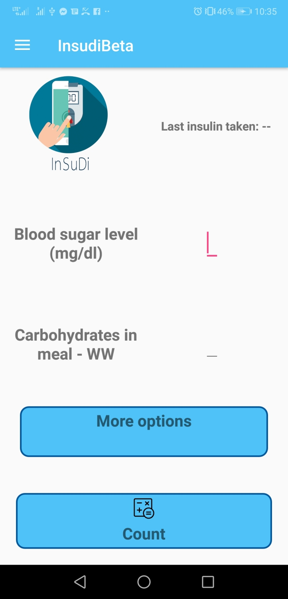
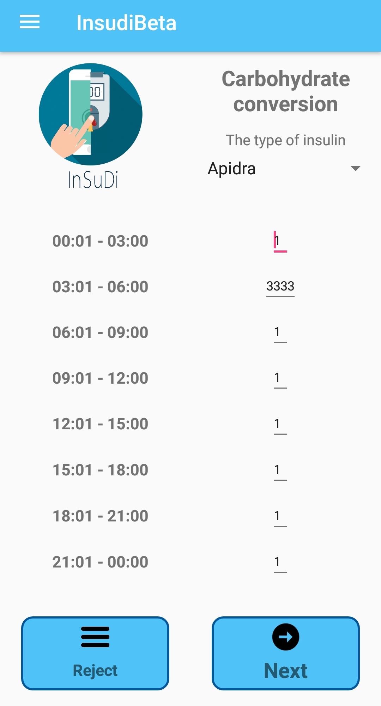
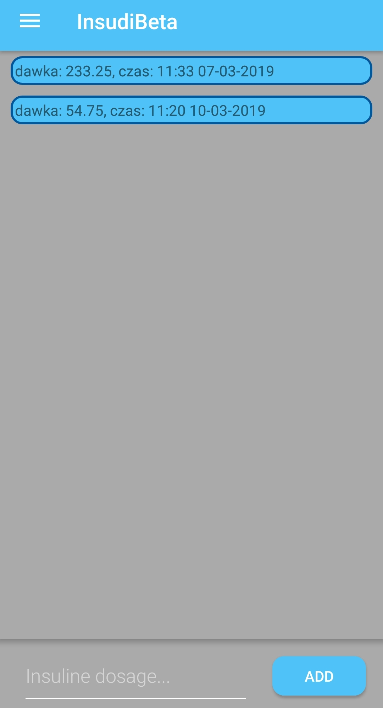

# InsudiBeta 💊 💉

Demo :  Mobile app for Diabetics with Enactus science club, which calculates amount of insulin need to be taken by diabetics

It is calculator for diabetics, it counts how much insulin should be taken after or before meal. Algorithm has some more options like countng insudi after training or use active insulin.

# The app is on GooglePlay

# View from The app
# Calculator

# User's settings 

# User's diary

